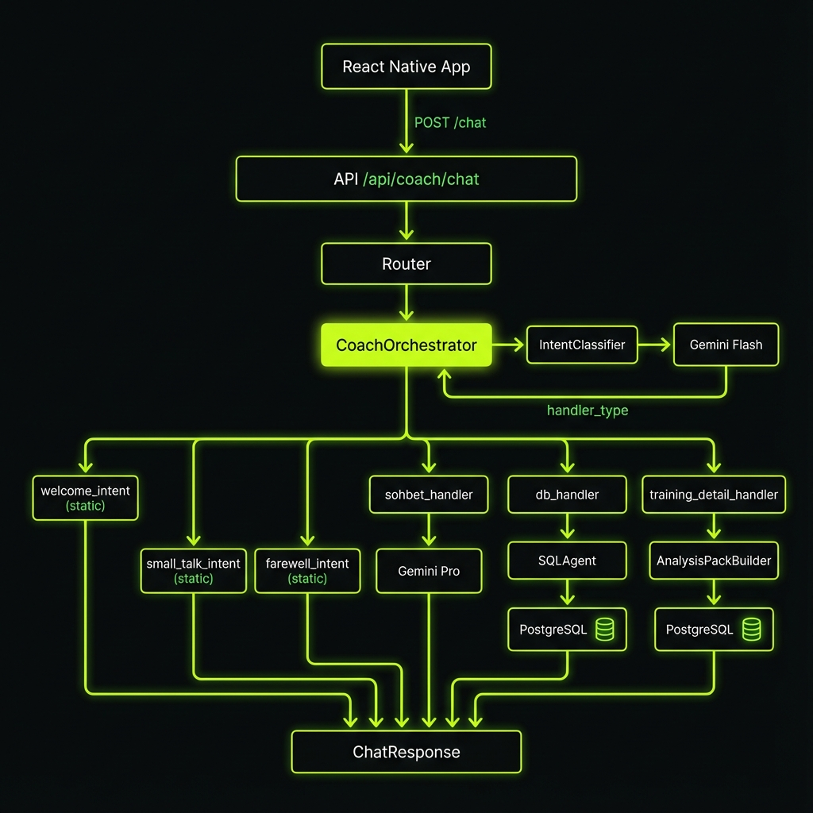

# Architecture Overview

## High-Level Architecture



## Component Responsibilities

| Component | File | Responsibility |
|-----------|------|----------------|
| Router | `router.py` | FastAPI endpoint, request validation |
| Orchestrator | `orchestrator.py` | Main flow control, handler routing |
| IntentClassifier | `intent_classifier.py` | AI-based intent detection |
| SQLAgent | `sql_agent.py` | Dynamic SQL generation and execution |
| AnalysisPackBuilder | `analysis_pack_builder.py` | Activity data preparation |
| LLMClient | `llm_client.py` | Gemini API abstraction |

## Data Flow

```
User Message
     │
     ▼
┌─────────────────────┐
│  IntentClassifier   │ ◄── Gemini Flash (fast)
│  (~100ms latency)   │
└──────────┬──────────┘
           │ handler_type
           ▼
┌─────────────────────┐
│   Handler Router    │
│  _route_by_handler  │
└──────────┬──────────┘
           │
     ┌─────┴─────┬─────────────┬───────────────┐
     ▼           ▼             ▼               ▼
┌─────────┐ ┌─────────┐ ┌───────────┐ ┌──────────────┐
│ Static  │ │ Sohbet  │ │ DB Query  │ │ Activity     │
│ Response│ │ (LLM)   │ │ (SQL+LLM) │ │ Analysis     │
└─────────┘ └─────────┘ └───────────┘ └──────────────┘
     │           │             │               │
     └───────────┴─────────────┴───────────────┘
                       │
                       ▼
                 ChatResponse
```

## Technology Stack

- **Backend**: FastAPI + SQLAlchemy
- **Database**: PostgreSQL
- **LLM Provider**: Google Gemini
  - Flash (intent classification)
  - Pro (deep analysis)
- **Frontend**: React Native + Expo
