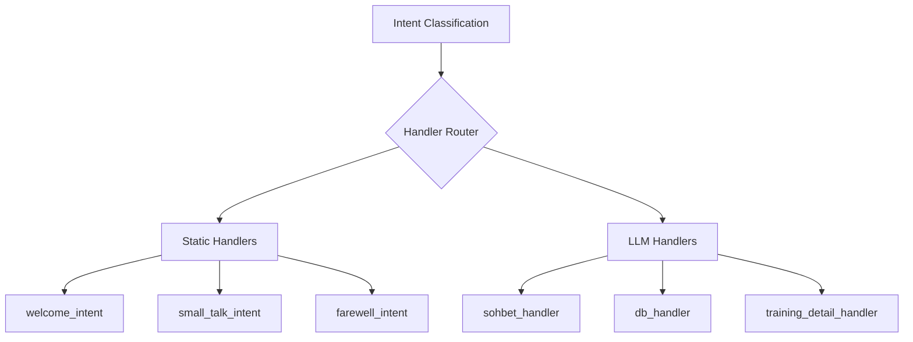

# Handlers

## Overview

Handlers are specialized processors that generate responses based on the classified intent.



## Static Handlers

These handlers return pre-defined responses without any LLM call.

### welcome_intent

**Trigger**: Greetings like "Selam", "Merhaba", "Hey"

**Response**:
```
Selam! 👋 

Bugün antrenmanını değerlendirebiliriz, haftalık yüklenmeye bakabiliriz, 
ya da aklındaki herhangi bir konuyu konuşabiliriz. Hazır olduğunda başlayalım.
```

### small_talk_intent

**Trigger**: Casual chat like "Nasılsın", "Naber hocam"

**Response**:
```
İyiyim, teşekkürler. 💪

Son koşunu analiz edebilirim ya da haftalık durumuna bakabiliriz. 
Hazır olduğunda söyle.
```

### farewell_intent

**Trigger**: Goodbye like "Hoşçakal", "Görüşürüz"

**Response**:
```
Görüşürüz! 👋 

Bir sonraki antrenmanda burada olacağım.
```

## LLM Handlers

These handlers use Gemini Pro for intelligent responses.

### sohbet_handler

**Purpose**: General conversation about running, training philosophy, etc.

**Flow**:
```
Message → COACH_PERSONA + RUNNING_EXPERTISE + Message → LLM → Response
```

**Prompt Structure**:
```python
prompt = f"""
{COACH_PERSONA}
{RUNNING_EXPERTISE}

# SOHBET KURALLARI
- Samimi, kısa ve net cevap ver.
- Tedesco tarzı: Düşünceli, doğrudan, gereksiz soru sorma.
- Max 2-3 cümle yeterli.

SPORCU MESAJI: {message}
"""
```

**Example**:
- Input: "Koşucu mindset nasıldır?"
- Output: "Koşucu zihniyeti dayanıklılık, disiplin ve sürekli gelişim arayışıdır..."

### db_handler

**Purpose**: Queries requiring database access (statistics, trends, comparisons)

**Flow**:
```
Message → SQLAgent → SQL Generation → Execution → Result Interpretation → Response
```

See [SQL Agent Documentation](./sql-agent.md)

**Example**:
- Input: "Bu hafta kaç km koştum?"
- Output: "Bu hafta toplam 42.5 km koştun, 5 aktivite ile..."

### training_detail_handler

**Purpose**: Deep analysis of specific activities

**Flow**:
```
Message → Fetch Activity → Build Analysis Pack → LLM Analysis → Response
```

**Pack Contents**:
- Activity metadata (name, date, distance, duration)
- Lap table with pace, HR, power
- Running dynamics
- Weather data
- Biometrics (sleep, HRV, stress from previous night)
- CTL/ATL/TSB fitness status

**Example**:
- Input: "Son koşumu analiz et"
- Output: "Bugünkü temponun 5:20/km seviyesinde tutarlı gitmiş..."

## Handler Configuration

All handlers follow the Tedesco communication style:

```python
İLETİŞİM TARZI (Tedesco tarzı):
- Düşünceli ve doğrudan konuş
- Sakin ama tutkulu ol
- Özgüvenli ol, ama kibirli olma
- SORU SORMA - Mesajın sonunda soru ekleme
- Kısa paragraflar kur
- Max 1-2 emoji kullan
```
