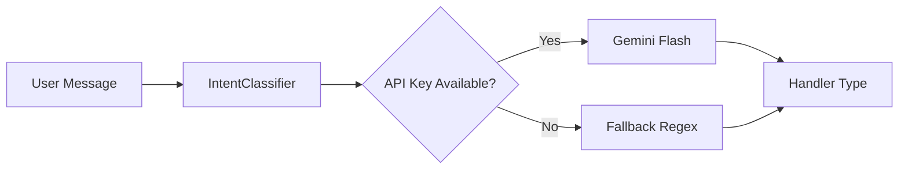

# Intent Classification

## Overview

The Intent Classifier uses Gemini Flash for fast, AI-based message classification.
It determines which handler should process the user's message.

## Architecture



## Handler Types

| Handler | Purpose | Response Type | LLM Calls |
|---------|---------|---------------|-----------|
| `welcome_intent` | Greetings (Selam, Merhaba) | Static | 0 |
| `small_talk_intent` | Casual chat (Nasılsın, Naber) | Static | 0 |
| `farewell_intent` | Goodbye (Hoşçakal, Görüşürüz) | Static | 0 |
| `sohbet_handler` | General conversation | LLM | 1 |
| `db_handler` | Data queries (Kaç km, trend) | SQL + LLM | 2 |
| `training_detail_handler` | Activity analysis | Data + LLM | 1 |

## Classification Prompt

```python
CLASSIFICATION_PROMPT = '''
Koşucu mesajı: "{message}"

Sadece şu handler isimlerinden BİRİNİ yaz, başka hiçbir şey yazma:
- welcome_intent (selam, merhaba, hey, iyi günler)
- small_talk_intent (nasılsın, naber, keyifler nasıl, ne haber)
- farewell_intent (hoşçakal, görüşürüz, bye, iyi geceler)
- sohbet_handler (genel sohbet, tavsiye, soru-cevap, koşu hakkında bilgi)
- db_handler (istatistik, trend, karşılaştırma, kaç km, ortalama, en hızlı, toplam)
- training_detail_handler (son koşu, antrenman analizi, bu koşu, dünkü koşu, son aktivite)

Handler:
'''
```

## Example Classifications

| Message | Handler | Confidence |
|---------|---------|------------|
| "Selam coach" | `welcome_intent` | 0.95 |
| "Naber hocam, nasılsın?" | `small_talk_intent` | 0.95 |
| "Hoşçakal" | `farewell_intent` | 0.95 |
| "Koşucu mindset nasıl olmalı?" | `sohbet_handler` | 0.90 |
| "Bu hafta kaç km koştum?" | `db_handler` | 0.95 |
| "Son koşumu analiz et" | `training_detail_handler` | 0.95 |

## Fallback Regex Patterns

When Gemini Flash is unavailable, the system uses pattern matching:

```python
# Greetings
if any(g in msg for g in ["selam", "merhaba", "hey"]):
    return "welcome_intent"

# Small talk
if any(s in msg for s in ["nasılsın", "naber", "ne haber"]):
    return "small_talk_intent"

# Farewell
if any(f in msg for f in ["hoşçakal", "görüşürüz", "bye"]):
    return "farewell_intent"

# Training detail
if any(t in msg for t in ["son koşu", "antrenman", "analiz"]):
    return "training_detail_handler"

# DB queries
if any(d in msg for d in ["kaç km", "toplam", "ortalama", "trend"]):
    return "db_handler"

# Default
return "sohbet_handler"
```

## Debug Output

```json
{
  "step": 0,
  "name": "AI Intent Classification",
  "status": "sohbet_handler",
  "description": "Gemini Flash → sohbet_handler",
  "details": {
    "model": "gemini-2.0-flash-lite",
    "raw_response": "sohbet_handler",
    "prompt_preview": "Koşucu mesajı: \"Koşucu mindset nasıl olmalı?\"..."
  }
}
```

## Performance

- **Gemini Flash Latency**: ~50-100ms
- **Fallback Regex Latency**: <1ms
- **Accuracy**: ~95% (based on testing)
