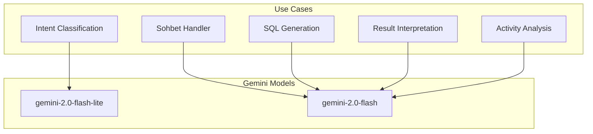
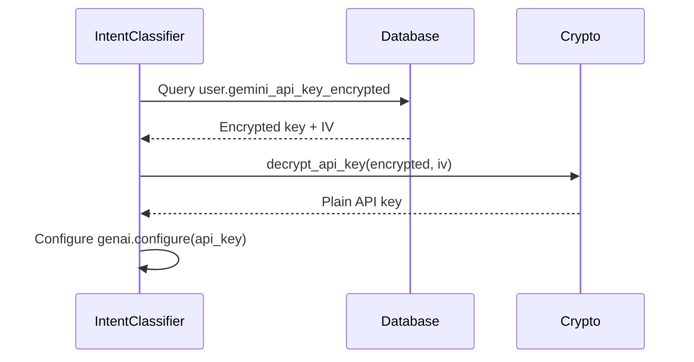

# LLM Configuration

## Overview

The Coach module uses Google Gemini models for AI capabilities.



## Model Selection

| Task | Model | Max Tokens | Temperature | Latency |
|------|-------|------------|-------------|---------|
| Intent Classification | `gemini-2.0-flash-lite` | 20 | 0.0 | ~100ms |
| Sohbet Conversation | `gemini-2.0-flash` | 300 | 0.7 | ~500ms |
| SQL Generation | `gemini-2.0-flash` | 600 | 0.0 | ~500ms |
| Result Interpretation | `gemini-2.0-flash` | 600 | 0.5 | ~500ms |
| Activity Analysis | `gemini-2.0-flash` | 500 | 0.7 | ~800ms |

## API Key Management

API keys are stored encrypted in the database:

```python
# Encryption at rest
user.gemini_api_key_encrypted = encrypt(api_key)
user.gemini_api_key_iv = initialization_vector

# Decryption at runtime
api_key = decrypt_api_key(
    user.gemini_api_key_encrypted, 
    user.gemini_api_key_iv
)
```

### Key Retrieval Flow



## LLM Client Implementation

```python
class GeminiClient:
    def __init__(self, api_key: str, model: str = "gemini-2.0-flash"):
        self.api_key = api_key
        self.model_name = model
        genai.configure(api_key=api_key)
        self.model = genai.GenerativeModel(model)
    
    def generate(
        self, 
        prompt: str, 
        max_tokens: int = 500,
        temperature: float = 0.7
    ) -> LLMResponse:
        config = genai.GenerationConfig(
            max_output_tokens=max_tokens,
            temperature=temperature
        )
        response = self.model.generate_content(prompt, generation_config=config)
        return LLMResponse(
            text=response.text,
            input_tokens=response.usage_metadata.prompt_token_count,
            output_tokens=response.usage_metadata.candidates_token_count,
            model=self.model_name
        )
```

## Communication Style: Tedesco

All LLM prompts include the Tedesco communication style:

```python
COACH_PERSONA = """
İLETİŞİM TARZI (Federico Tedesco tarzı):
- Düşünceli ve doğrudan konuş. Her cümlen bir amaca hizmet etsin.
- Sakin ama tutkulu ol. Gereksiz heyecan gösterme, ama işini ciddiye al.
- Özgüvenli ol, ama kibirli olma. Bildiğin şeyi net söyle.
- Açıklamalarını tamamla, yarım bırakma. Koşucu kafasında soru kalmasın.
- SORU SORMA - Sadece gerçekten cevaba ihtiyacın varsa sor.
- Kısa cümleler kur. Paragraflar 2-3 cümleyi geçmesin.
- Emoji kullanabilirsin ama abartma (max 1-2 per message).
- "Sen" diye hitap et, "siz" resmi.

ASLA YAPMA:
- Her mesajın sonuna soru ekleme.
- Veri yokken sayı uydurma.
- Robotik format kullanma.
- Uzun paragraflar yazma.
"""
```

## Error Handling

```python
try:
    response = self.llm.generate(prompt)
except Exception as e:
    logging.error(f"LLM generation failed: {e}")
    return fallback_response
```

## Cost Considerations

| Model | Input Cost | Output Cost |
|-------|------------|-------------|
| gemini-2.0-flash-lite | Free tier | Free tier |
| gemini-2.0-flash | $0.075/1M | $0.30/1M |

### Estimated Cost Per Request

| Handler | LLM Calls | Avg Tokens | Est. Cost |
|---------|-----------|------------|-----------|
| Static | 0 | 0 | $0.00 |
| Sohbet | 1 | ~400 | $0.00012 |
| DB Handler | 2 | ~1200 | $0.00045 |
| Activity Analysis | 1 | ~1000 | $0.00030 |
