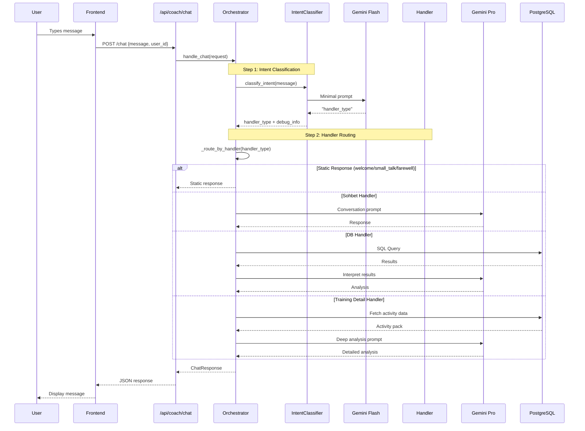
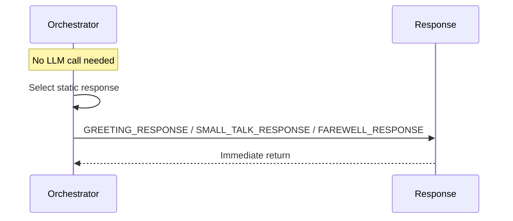
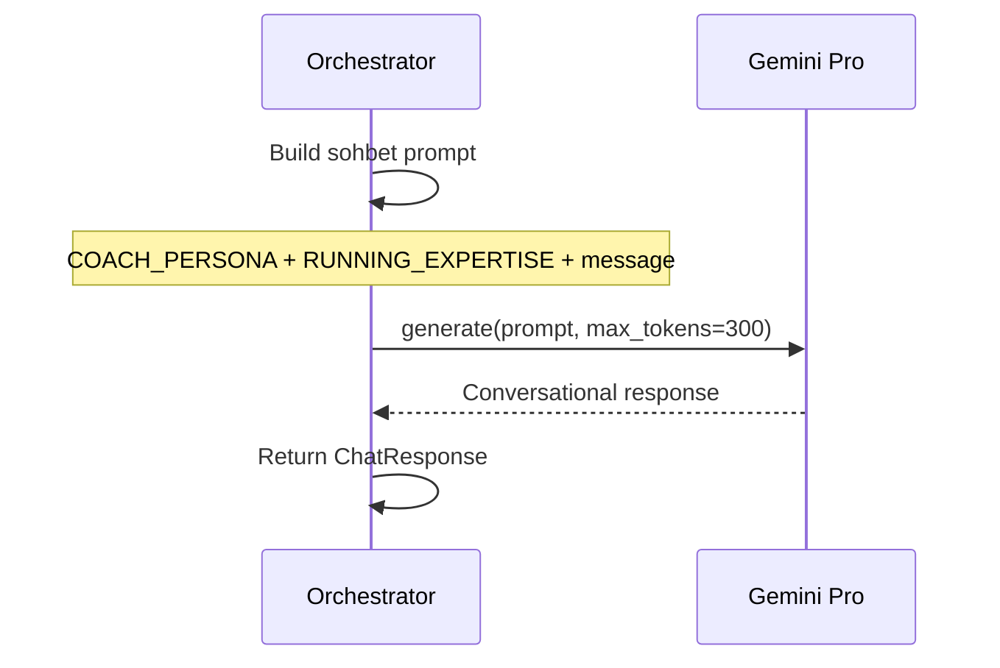
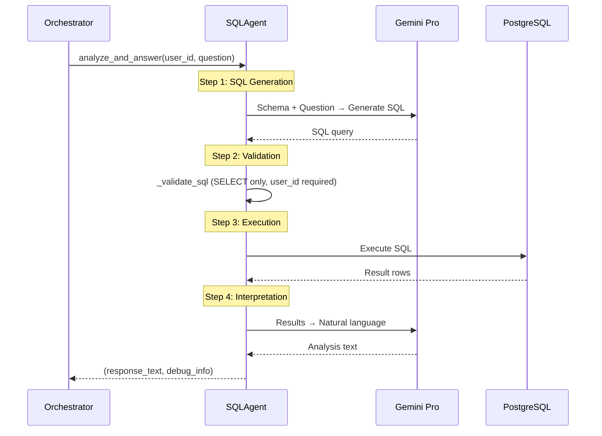
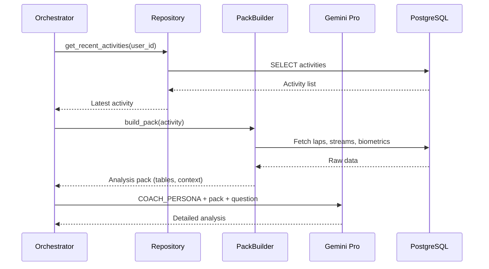
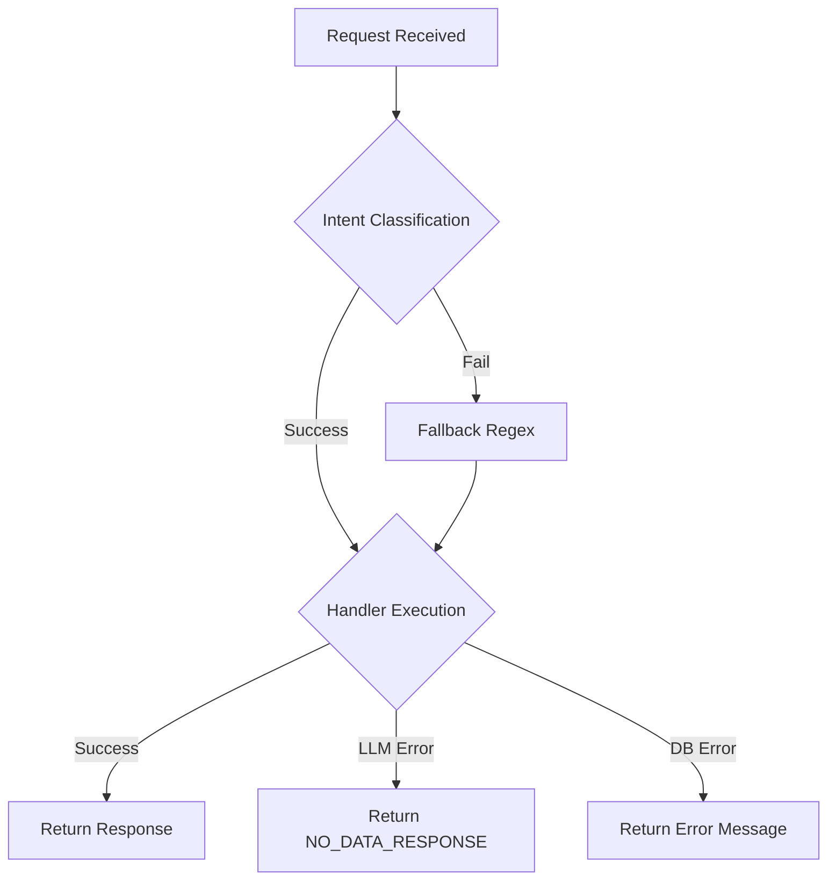

# Request Flow

## Overview

Every user message follows the same initial path, then branches based on AI classification.

## Sequence Diagram: Complete Request Lifecycle



## Handler-Specific Flows

### 1. Static Handlers (welcome/small_talk/farewell)



**Latency**: ~100ms (only intent classification)

### 2. Sohbet Handler



**Latency**: ~500-1000ms

### 3. DB Handler (SQL Agent)



**Latency**: ~1500-3000ms (2 LLM calls + DB query)

### 4. Training Detail Handler



**Latency**: ~2000-4000ms (DB queries + LLM)

## Debug Steps Output

Each handler produces debug_steps for frontend display:

```json
{
  "debug_steps": [
    {
      "step": 0,
      "name": "AI Intent Classification",
      "status": "db_handler",
      "description": "Gemini Flash → db_handler",
      "details": {
        "model": "gemini-2.0-flash-lite",
        "raw_response": "db_handler"
      }
    },
    {
      "step": 1,
      "name": "Handler",
      "status": "db_handler",
      "description": "SQL Agent sorgusu"
    },
    {
      "step": 2,
      "name": "SQL Generation",
      "status": "success"
    },
    {
      "step": 3,
      "name": "SQL Validation",
      "status": "success"
    },
    {
      "step": 4,
      "name": "SQL Execution",
      "status": "success"
    },
    {
      "step": 5,
      "name": "Result Interpretation",
      "status": "success"
    }
  ]
}
```

## Error Handling


