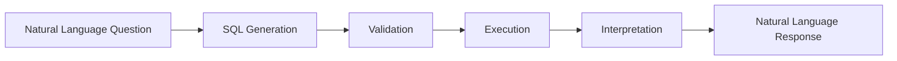
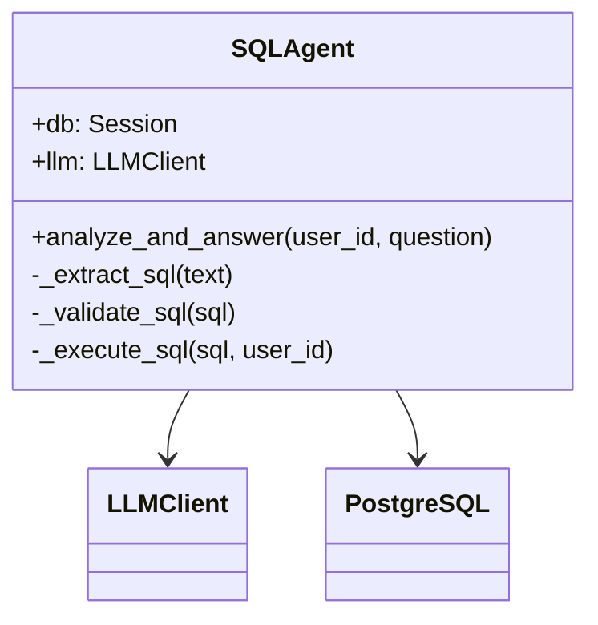

# SQL Agent

## Overview

The SQL Agent enables the coach to answer any data-related question by dynamically generating and executing SQL queries.



## Architecture



## Pipeline Steps

### Step 1: SQL Generation

**Input**: User question + Full database schema

**Prompt**:
```
{FULL_SCHEMA_CONTEXT}

# KULLANICI SORUSU
{question}

# TALİMAT
1. Bu soruyu cevaplamak için gerekli SQL sorgusunu yaz
2. Sadece SELECT sorgusu yazabilirsin
3. user_id = :user_id filtresini MUTLAKA ekle
4. LIMIT 100 ile sınırla
5. Sadece SQL döndür, açıklama yazma

SQL:
```

**Output**: Raw SQL query

### Step 2: Validation

Security checks:
- Must start with `SELECT`
- No dangerous keywords: `DELETE`, `DROP`, `UPDATE`, `INSERT`
- Must include `user_id` filter

```python
def _validate_sql(self, sql: str) -> bool:
    sql_upper = sql.upper().strip()
    
    if not sql_upper.startswith("SELECT"):
        return False
    
    dangerous = ["DELETE", "DROP", "UPDATE", "INSERT", "ALTER", "TRUNCATE"]
    for d in dangerous:
        if d in sql_upper:
            return False
    
    if "user_id" not in sql.lower():
        return False
    
    return True
```

### Step 3: Execution

```python
def _execute_sql(self, sql: str, user_id: int) -> List[Dict]:
    result = self.db.execute(text(sql), {"user_id": user_id})
    columns = result.keys()
    rows = result.fetchall()
    return [dict(zip(columns, row)) for row in rows[:100]]
```

### Step 4: Interpretation

**Prompt**:
```
Sen bir koşu koçusun. Veritabanından çekilen verileri yorumla.

İLETİŞİM TARZI (Tedesco tarzı):
- Düşünceli ve doğrudan konuş
- SORU SORMA
- Kısa paragraflar kur
- Max 1-2 emoji kullan

# KULLANICI SORUSU
{question}

# SQL SORGUSU
{sql}

# SORGU SONUÇLARI
{results}

# TALİMAT
- Gerçek verilere dayalı cevap ver
- VO2max değişimini hesaba kat
- Korelasyonları belirt (uyku, stres, HRV etkileri)
- 100-150 kelime yeterli
```

## Database Schema

The agent has access to 7 main tables:

| Table | Purpose | Key Columns |
|-------|---------|-------------|
| `activities` | Run/activity data | distance, duration, average_hr, vo2_max |
| `activity_streams` | GPS data per second | heart_rate, speed, altitude |
| `sleep_logs` | Sleep data | sleep_score, deep_seconds |
| `hrv_logs` | Heart rate variability | last_night_avg, status |
| `stress_logs` | Stress levels | avg_stress, max_stress |
| `physiological_logs` | Daily metrics | resting_hr, lactate_threshold_hr |
| `shoes` | Running shoes | name, brand, initial_distance |

## Example Queries

### Weekly Distance
```sql
SELECT 
    SUM(distance) / 1000.0 as total_km,
    COUNT(*) as run_count
FROM activities
WHERE user_id = :user_id 
    AND local_start_date >= CURRENT_DATE - INTERVAL '7 days'
LIMIT 100;
```

### Sleep vs Performance Correlation
```sql
SELECT 
    CASE WHEN s.sleep_score >= 80 THEN 'İyi Uyku'
         ELSE 'Kötü Uyku' END as uyku,
    AVG(a.average_hr) as ortalama_nabiz,
    COUNT(*) as kos_sayisi
FROM activities a
JOIN sleep_logs s ON a.user_id = s.user_id 
    AND a.local_start_date = s.calendar_date
WHERE a.user_id = :user_id
GROUP BY uyku
LIMIT 100;
```

## Debug Output

```json
{
  "steps": [
    {
      "step": 1,
      "name": "SQL Generation",
      "status": "success",
      "extracted_sql": "SELECT SUM(distance)/1000 as km FROM activities WHERE user_id = :user_id"
    },
    {
      "step": 2,
      "name": "SQL Validation",
      "status": "success",
      "is_valid": true
    },
    {
      "step": 3,
      "name": "SQL Execution",
      "status": "success",
      "result_count": 1
    },
    {
      "step": 4,
      "name": "Result Interpretation",
      "status": "success"
    }
  ]
}
```
